# Event Details

https://www.meetup.com/en-AU/LA-Animation-and-VFX-Pipeline-Developers-Meetup/events/254858357/

# Lightning talk : VR Workflows using Google Tilt Brush, Pixar Universal Scene Description and Unity 3D
 
    by Satish Goda (Department Technical Director)
    satish.goda@pearlstudio.com

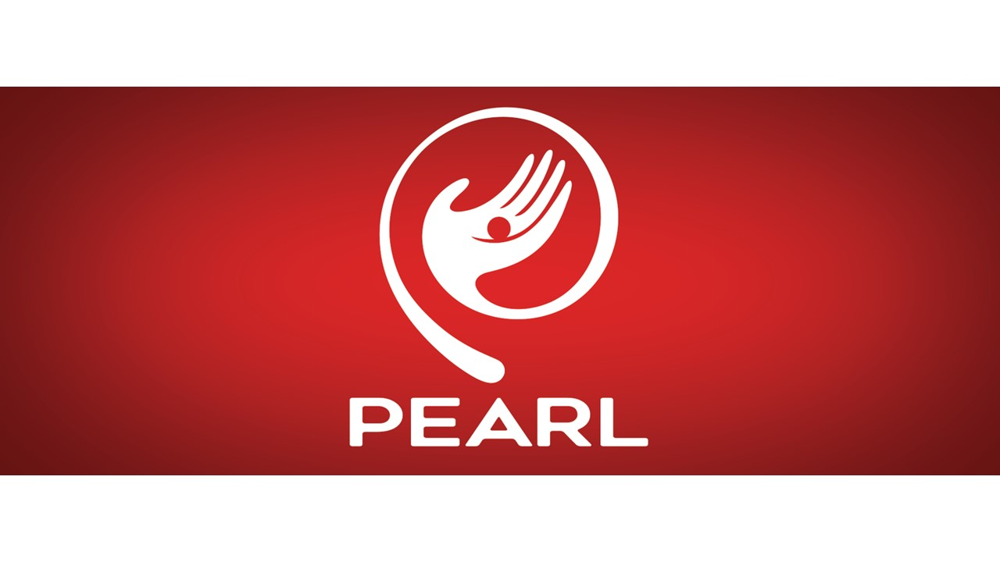

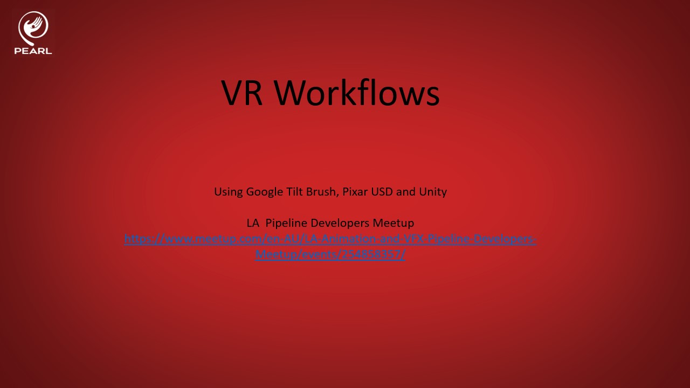

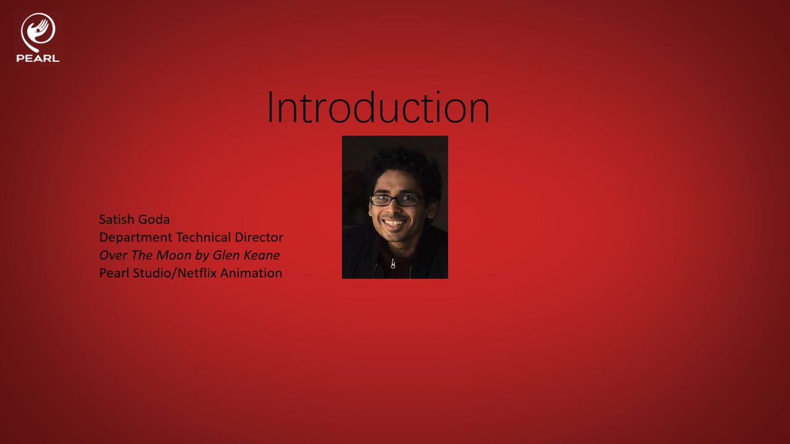

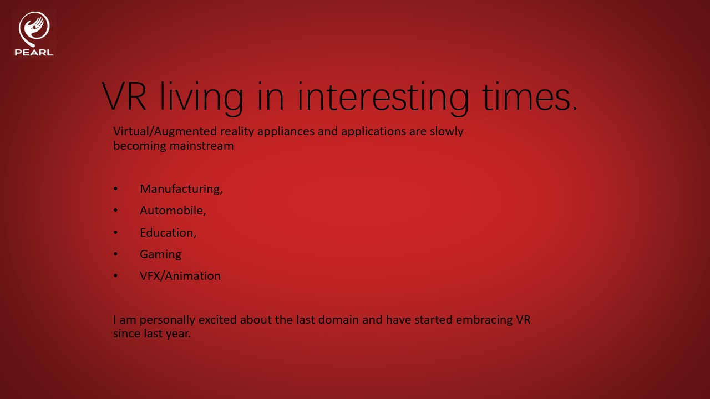

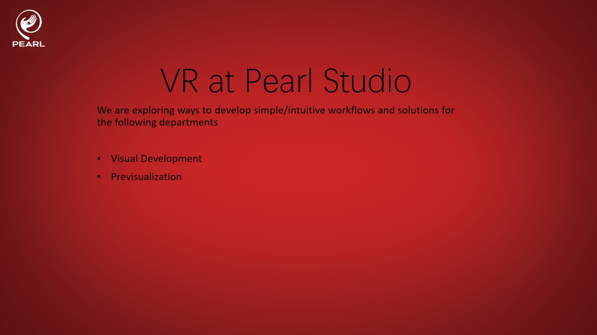

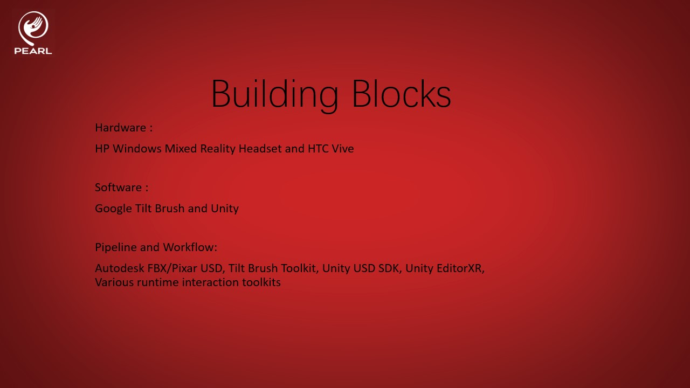

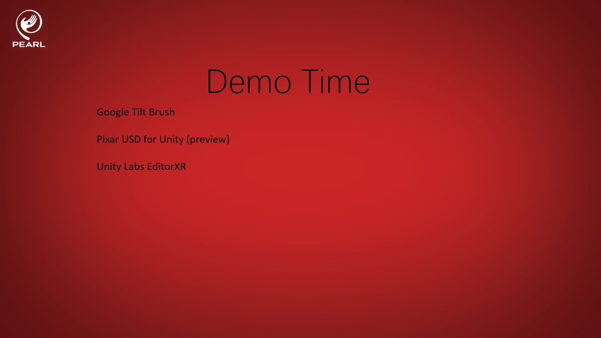

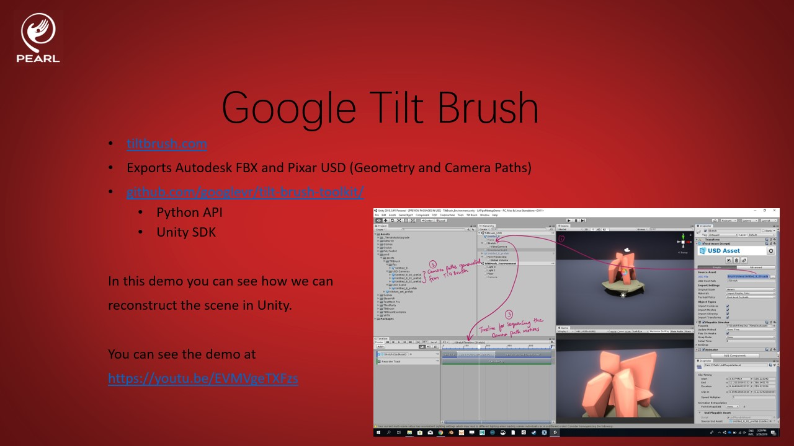

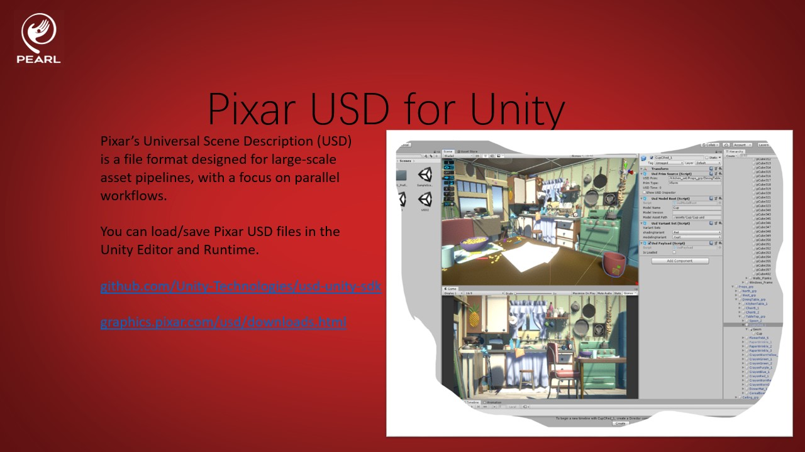

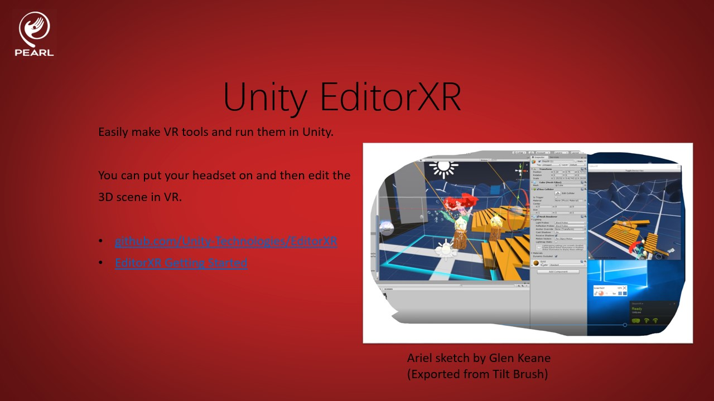

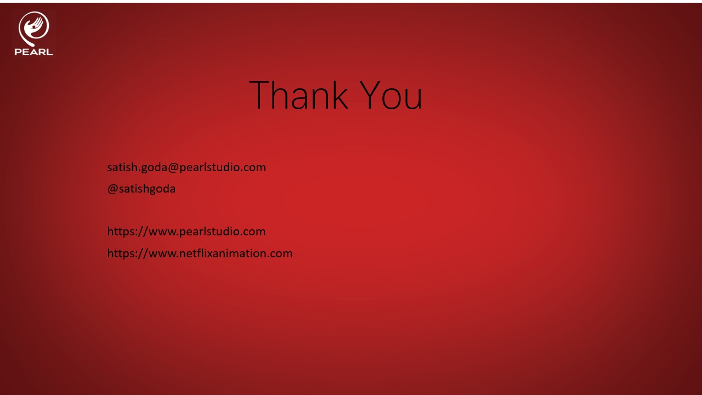

You can also download a pdf at [LA_Pipeline_Developers_Meetup_03272019_SatishGoda_VR-Workflows-PearlStudio.pdf] (https://github.com/PearlStudio/Presentations/raw/LAPipeDevelopersMeetup/03172019/LightningTalks/slides/LA_Pipeline_Developers_Meetup_03272019_SatishGoda_VR-Workflows-PearlStudio.pdf LA Pipeline Developers Meetup - 03272019 - VR Workflows Pearl Studio.pdf)
